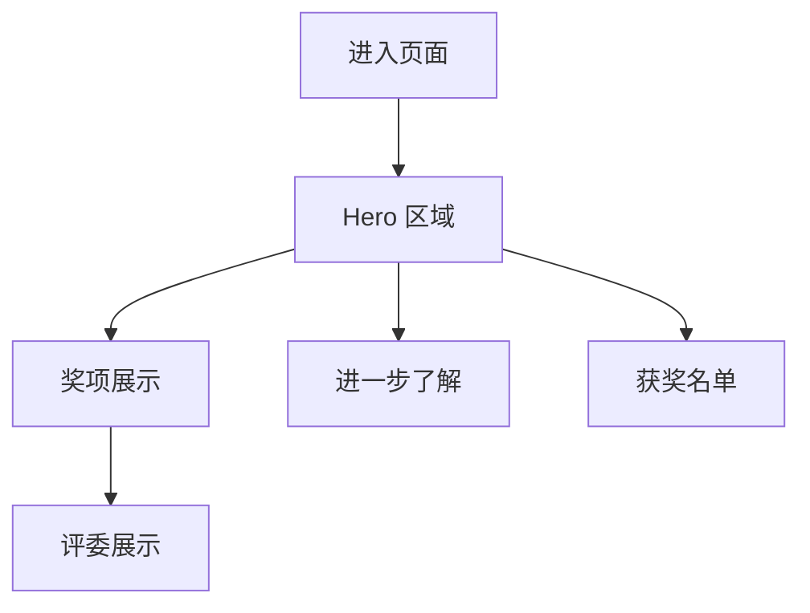

# IPOA 界面生态 PPTOS 创意设计大赛 - 产品需求文档

## 1. 产品概述

为「界面生态 PPTOS 创意设计大赛」打造一个单页介绍网站，使用 Next.js + shadcn/ui (New York style) 构建。页面用于展示大赛信息、奖项设置、评委阵容等核心内容，面向设计爱好者和参赛者。

## 2. 核心功能

### 2.1 功能模块

1. **Hero 区域**: 大赛标题、副标题、CTA 按钮（进一步了解 / 获奖名单）
2. **奖项展示**: 一等奖、二等奖、三等奖、优秀奖、黑马突围奖、人气之星的详细信息
3. **评委展示**: 9 位评委的头像、姓名和简介卡片

### 2.2 页面详情

| 页面名称 | 模块名称    | 功能描述                        |
| ---- | ------- | --------------------------- |
| 首页   | Hero 区域 | 展示大赛标题、介绍文字、两个 CTA 按钮，带动画效果 |
| 首页   | 奖项展示    | 以卡片网格展示 6 类奖项，含等级、占比、奖励列表   |
| 首页   | 评委展示    | 以头像卡片网格展示 9 位评委信息           |
| 首页   | 页脚      | 版权信息、相关链接                   |

## 3. 核心流程

用户进入页面 → 浏览 Hero 区域了解大赛概况 → 向下滚动查看奖项设置 → 继续滚动查看评委阵容 → 点击 CTA 按钮跳转了解详情或查看获奖名单

## 4. 用户界面设计

### 4.1 设计风格

- 使用 shadcn/ui New York 风格，偏现代、精致
- 主色调：深色主题，搭配品牌蓝色作为强调色
- 布局：单页纵向滚动，卡片式布局
- 使用 lucide-react 图标

### 4.2 页面设计概览

| 页面名称 | 模块名称 | UI 元素                |
| ---- | ---- | -------------------- |
| 首页   | Hero | 全屏高度、大标题动画           |
| 首页   | 奖项展示 | 6 列响应式网格、卡片悬停效果、等级标识 |
| 首页   | 评委展示 | 3x3 网格、圆形头像、悬停放大效果   |

### 4.3 响应式设计

桌面优先，移动端自适应。断点：sm(640px)、md(768px)、lg(1024px)、xl(1280px)
