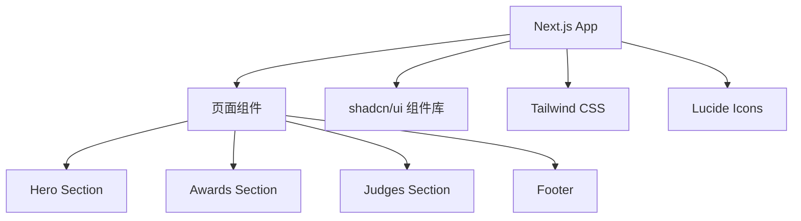

# IPOA 界面生态大赛 - 技术架构文档

## 1. 架构设计



## 2. 技术栈

- **框架**: Next.js 14 (App Router)
- **UI 组件库**: shadcn/ui (New York style)
- **样式**: Tailwind CSS 3
- **图标**: lucide-react
- **语言**: TypeScript

## 3. 路由定义

| 路由  | 用途            |
| --- | ------------- |
| `/` | 单页介绍页面，包含所有内容 |

## 4. 项目结构

```
src/
  app/
    layout.tsx        # 根布局，字体配置
    page.tsx          # 主页面
    globals.css       # 全局样式 + shadcn 主题变量
  components/
    hero-section.tsx  # Hero 区域
    awards-section.tsx # 奖项展示
    judges-section.tsx # 评委展示
    footer.tsx        # 页脚
components/
  ui/                 # shadcn/ui 组件
```

## 5. 依赖项

- next
- react / react-dom
- tailwindcss
- @radix-ui/\* (shadcn/ui 依赖)
- lucide-react
- class-variance-authority
- clsx
- tailwind-merge

